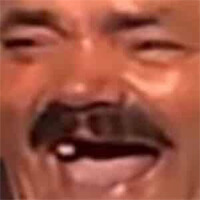

## Quest Info

**Quest Types:**  
MQ - Main Quest  
SQ - Side Quest  
C - Contract  
TH - Treasure Hunt  
G&HP - Gwent & The Heroes' Pursuit  
SH - Scavenger Hunt  
CE - Chance Encounter

---

Completion order doesn't matter for quests marked with  



## Importing/Exporting quest data

Exported/Imported data is in JSON format, relatively simple structure:
```
[
  {
    "id": 0,
    "name": "Kaer Morhen (1)",
    "isCompleted": false
  },
  {
    "id": 1,
    "name": "Lilac and Gooseberries Part 1 (1)",
    "isCompleted": true
  },
  ...
]
```

You can modify "isCompleted" value by changing it to true/false  
(true - marks quest as completed, false - the opposite)  
However, you should only do this if you do not have access to the internet and plan to import data later.

Other fields shouldn't be modified, because import function will fail to work.


## Other info
Data is stored in the browser's local storage, so it would be a good precaution to export quest data periodically or when you are going to delete browser data.
